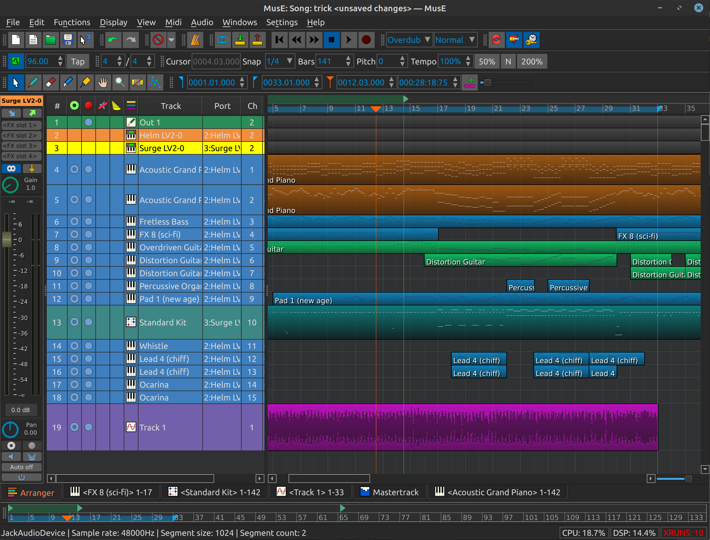

MusE  5.0 Beta 
============================
MusE is a MIDI/Audio sequencer with recording and editing capabilities written originally by 
 Werner Schweer now developed and maintained by the MusE development team. 
MusE aims to be a complete multitrack virtual studio for Linux.
It is published under the GNU General Public License. 

Visit the original MusE web site at: https://muse-sequencer.github.io/

## THIS IS A FORK, of original MusE 4.0 that adds these:

### FEATURES 

- new look and feel through QT6 (QT >= 6.8, transition from qt5)
- Qlementine Style Engine (included with bug-fixes)
- user editable theming
- smooth canvas scrolling , fast dragging
- CLAP Plugin Host for Synth AND Effects 
- MIDI Ports - automatic scan and naming
- improved debugging framework with ASAN in cmake

### BUG FIXES

- mixer did not restore levels, fixed
- race conditions (on delete) 
- XML parsing, fixed
- midi ports (made more reliable)
- canvas, part dragging fix, far better response times
- remove of depricated functions and warnings (gcc 16+ and cmake >= 3.21)
- replaced outdated macros in synthi plugins
- qlementine 1.4.2 - had multiple bugs, thus a patched version got included

### TODO

- minor style fixes (transport width)
- possible hang on template loading ? (scrutinize)
- on-start : popup conflict ("safe current/defaul" vs. "continue" )
- keyboard shortcuts - disabled ?? (scrutinize)

### The FORK IS usable already and appears crash free so far. 

Most Linux distributions include MusE ready to install, check your package manager.

Installation from source code:
------------------------------
Stable source code releases are [here](https://github.com/muse-sequencer/muse/releases).
Or one of the git branches can be cloned, built, and installed.

Installation instructions are in the [README](src/README) file.

Documentation:
--------------
[LICENSE](src/COPYING)
[AUTHORS](src/AUTHORS)

These and other important documents, READMEs, and addendums are in the [src](src) directory.

The official MusE Manual (work in progress) has migrated to the wiki and can be found [here](https://github.com/muse-sequencer/muse/wiki/Documentation).
